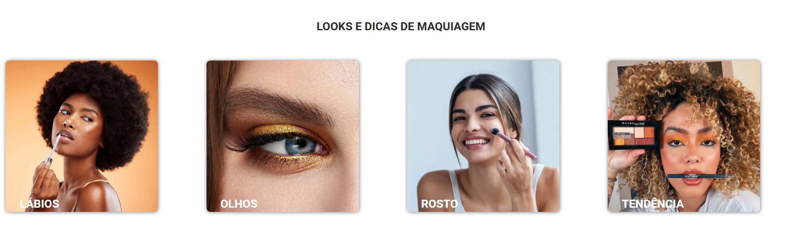
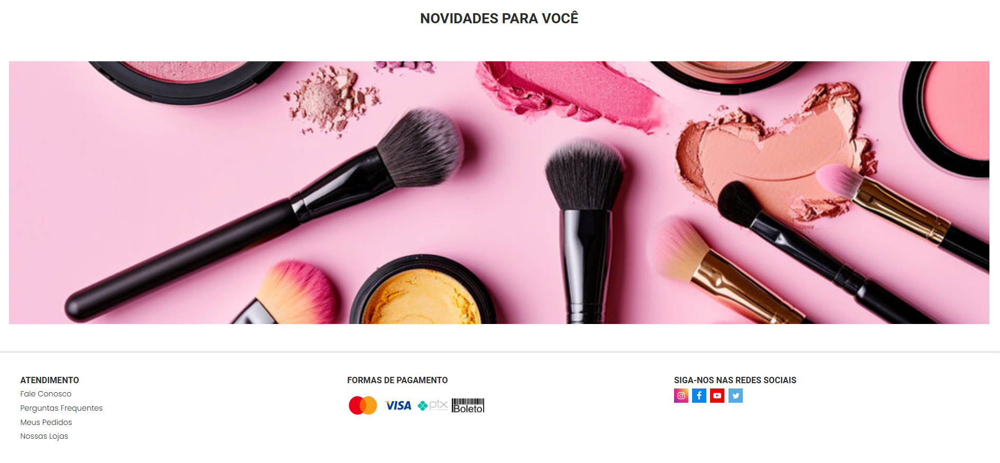

> Uma landing page moderna e responsiva sobre maquiagem, desenvolvida com React, JavaScript, HTML e SCSS.
> Esse projeto foi criado como prática de front-end, explorando conceitos de componentização, animações, estilização modular e estados dinâmicos.

# Demonstração
https://ex7-cursovnw.vercel.app/

# Página do projeto:

| Tecnologia          | Uso                                          |
| ------------------- | -------------------------------------------- |
| **React**           | Componentização e gerenciamento de interface |
| **JavaScript ES6+** | Lógica da aplicação                          |
| **HTML5**           | Estrutura semântica                          |
| **SCSS (Sass)**     | Estilização avançada e responsiva            |

# Objetivo do Projeto
O foco deste projeto é:
Aprimorar a habilidade de construir interfaces modernas
Praticar React com SCSS  
Criar um ambiente visual inspirador e profissional
Reforçar conceitos como useState, componentização e responsividade
